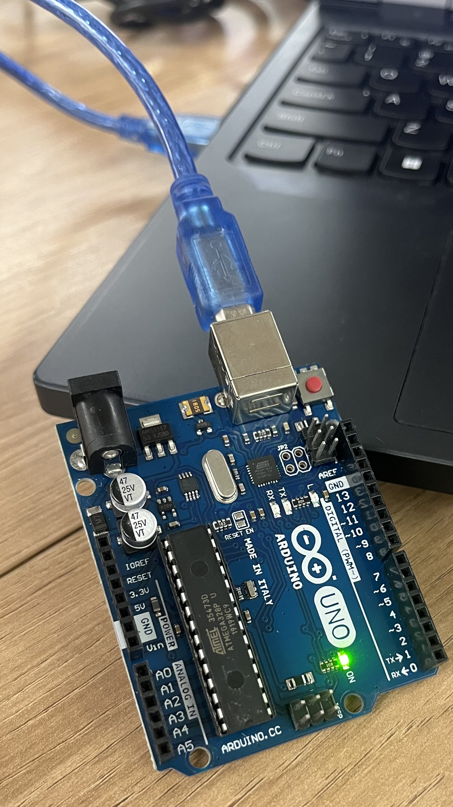
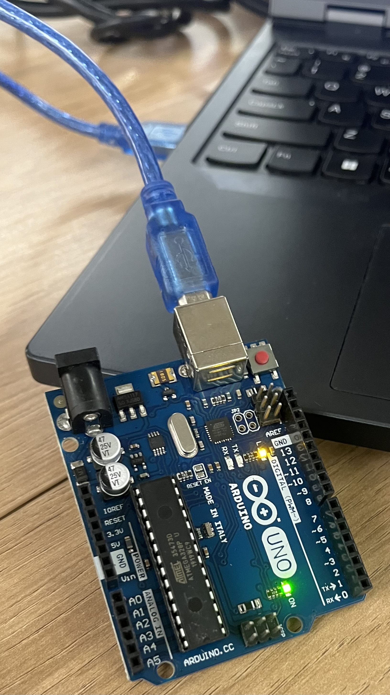

# Parte 1

### Código utilizado na plataforma Arduino IDE

// the setup function runs once when you press reset or power the board
void setup() {
  // initialize digital pin LED_BUILTIN as an output.
  pinMode(LED_BUILTIN, OUTPUT);
}

// the loop function runs over and over again forever
void loop() {
  digitalWrite(LED_BUILTIN, HIGH);  // turn the LED on (HIGH is the voltage level)
  delay(1000);                      // wait for a second
  digitalWrite(LED_BUILTIN, LOW);   // turn the LED off by making the voltage LOW
  delay(1000);                      // wait for a second
}
### Luz apagada

### Luz Acesa

### Video está no repositorio

# Parte 2

Link para a atividade 2: https://www.tinkercad.com/things/fG8gpwrTnr2-ponderada-1-arduino?sharecode=jymyS1gU8bIOv84BzVv7GCh1iB8sUMPJPx4yn7QW7_g

Codigo utilizado:

// C++ code
//
void setup()
{
  pinMode(8, OUTPUT);
}

void loop()
{
  digitalWrite(8, HIGH);
  delay(1000); // Wait for 1000 millisecond(s)
  digitalWrite(8, LOW);
  delay(1000); // Wait for 1000 millisecond(s)
}